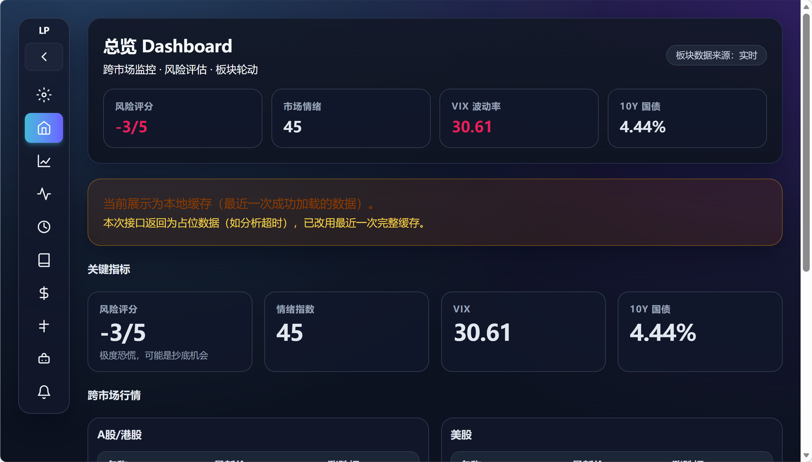
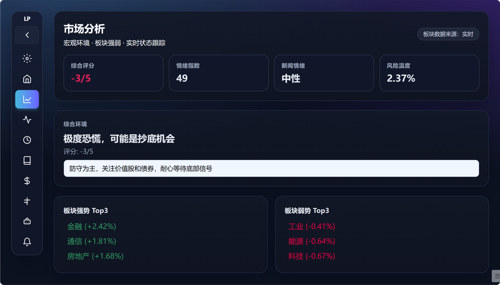
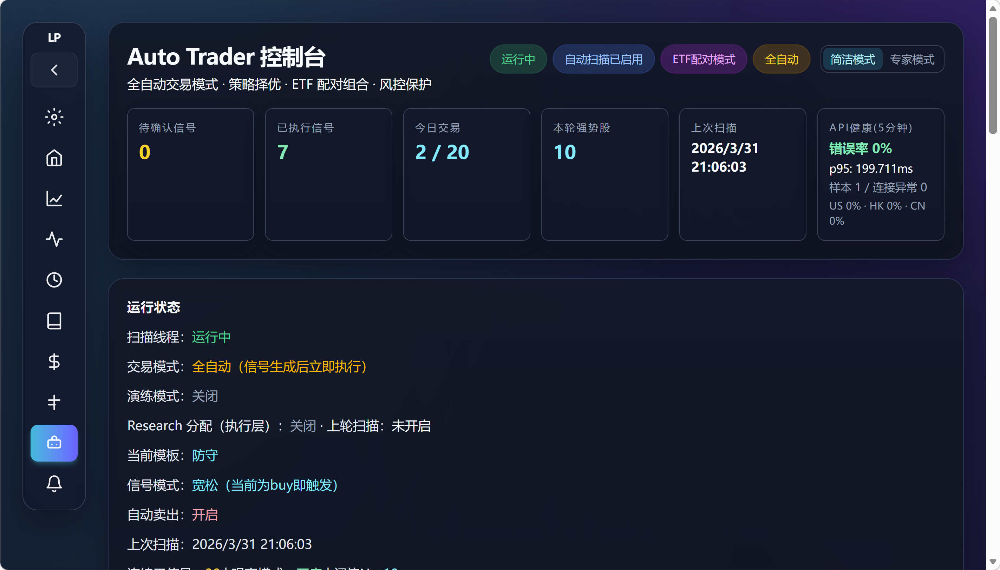
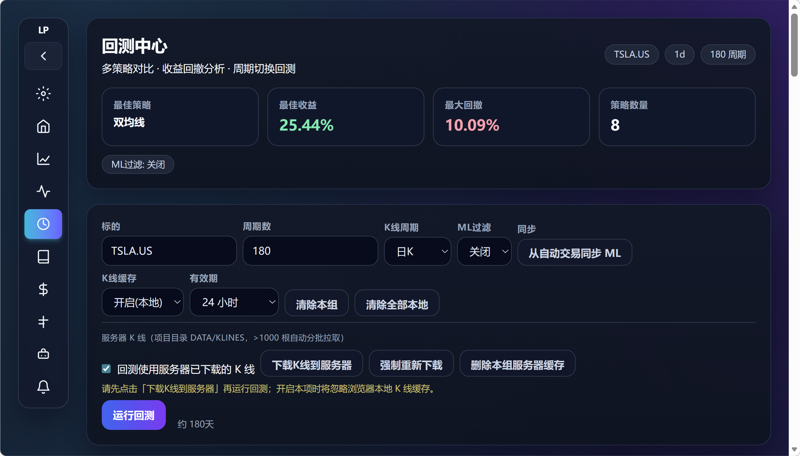
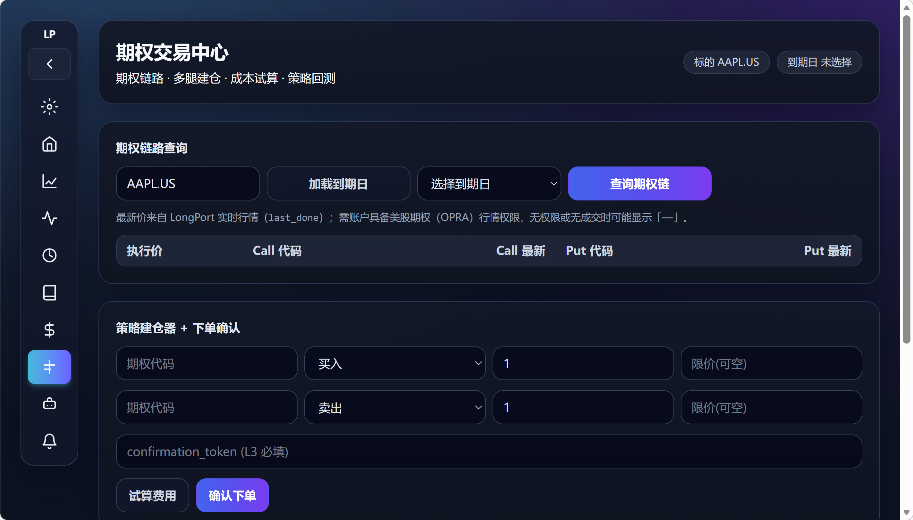
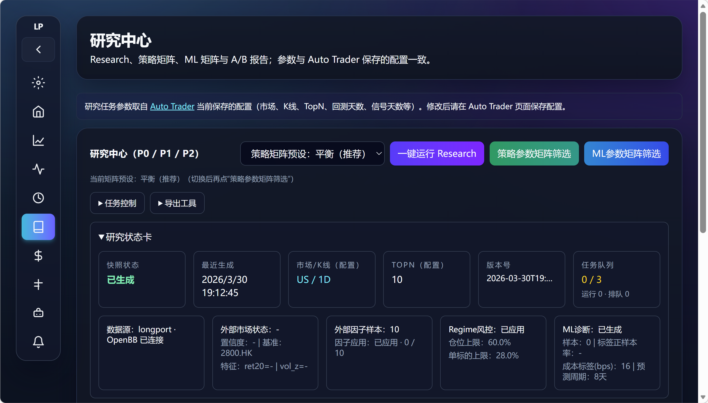

# LongPort(长桥证券） OpenClaw (Open Source Edition)

一个面向 US/HK/CN 市场的量化研究与交易控制台。  
支持市场分析、策略回测、自动交易、通知与配置管理。

##它支持两种使用方式：

- **可视化 UI 模式**：在网页中完成配置、分析、回测、信号扫描、下单、通知管理
- **智能体 MCP 模式**：让 OpenClaw/Claude 等智能体通过 MCP 工具调用交易能力

> Warning: 本项目为研究与工程框架，不构成投资建议。

---

## 功能概览

- 多市场总览与市场分析（情绪、宏观、板块轮动）
- 回测与参数对比（支持多周期 K 线）
- AutoTrader（半自动/全自动/演练模式）
- 风控与执行控制（冷却、同标的限制、日内次数等）
- 通知与观察模式（支持飞书消息推送）
- 配置快照、导入导出、回滚

---

## 技术栈

- Backend: FastAPI
- Frontend: Next.js + Tailwind
- Strategy Engine: 自研组件化规则引擎
- Integrations: MCP tools + Broker/Data APIs

---

## 目录结构

```text
.
├── api/          # 后端 API 与自动交易逻辑
├── frontend/     # Web 控制台
├── mcp_server/   # MCP 能力与工具
├── config/       # 配置模块
├── scripts/      # 启动脚本
├── tests/        # 测试
└── docs/         # 文档
```

---

## 快速开始

## 1) 环境要求

- Python 3.10+
- Node.js 18+
- npm / pnpm

## 2) 安装依赖

```bash
pip install -r requirements.txt
cd frontend
npm install
```

## 3) 配置环境变量

- 复制 `.env.example` 为 `.env`
- 填写你自己的 API 凭证（不要提交到仓库）

## 4) 启动

后端：

```bash
python launcher.py
```

前端：

```bash
cd frontend
npm run dev
```

默认访问：`http://localhost:3000`

---

## 主要页面

- `Dashboard`：跨市场总览与关键指标
- `Market`：市场分析与板块轮动
- `Backtest`：策略回测与参数比较
- `Trade / Options`：交易与订单管理
- `AutoTrader`：自动交易配置、扫描与信号执行
- `Notifications`：通知偏好与推送状态
- `Setup`：系统配置与服务状态

---

## 合规与免责声明

本项目为开源的量化研究/交易框架，不构成任何投资建议或收益承诺。  
使用者应自行确保其行为符合所在地法律法规及第三方服务条款。

- 本项目可能对接第三方数据源、券商接口或相关 SDK。
- 数据展示、存储、再分发、商用权限受各提供方条款约束。
- API Key、Token、Webhook、账户凭证由使用者自行配置与保管。
- 本项目与第三方平台/品牌无隶属、认证或背书关系（除非另有明确声明）。
- 因策略、系统、网络、数据误差造成的损失由使用者自行承担。

使用本项目即表示你已阅读并同意遵守相关上游许可证与第三方服务条款。

---

## 安全说明

- 严禁提交 `.env`、密钥、Token、Webhook、账户凭证
- 示例配置请使用 `*.example` 文件
- 如发现密钥泄露，请立即轮换并清理历史提交

---

## 第三方依赖

- Python 依赖见 `requirements.txt`
- 前端依赖见 `frontend/package.json`
- 第三方声明建议补充到 `THIRD_PARTY_NOTICES.md`

---

## 开源协议

本项目采用 `LICENSE` 中声明的协议发布。  
若你 fork 或二次分发，请保留原有版权与许可证声明。

---

## 贡献

欢迎提交 Issue / PR：

1. Fork 仓库并创建分支
2. 完成开发与自测
3. 提交 PR，并说明变更背景与验证结果

---

## 参考链接

- [LongPort OpenAPI](https://open.longportapp.com/)
- [Model Context Protocol](https://github.com/modelcontextprotocol)

- ## 项目截图
> 界面会随版本迭代，截图仅供参考。






---
## 社区与支持
- 问题反馈（Issues）：https://github.com/weiyuan0917-a11y/longport-openclaw/issues
- 交流讨论（Discussions）：https://github.com/weiyuan0917-a11y/longport-openclaw/discussions
如果你遇到问题，建议在 Issue 中提供：
- 运行环境（系统 / Python / Node 版本）
- 复现步骤
- 相关日志或截图（请先打码敏感信息）
---
## 联系方式
- 邮箱：weiyuan_917@qq.com
- 微信&QQ（仅合作沟通）：178522360


